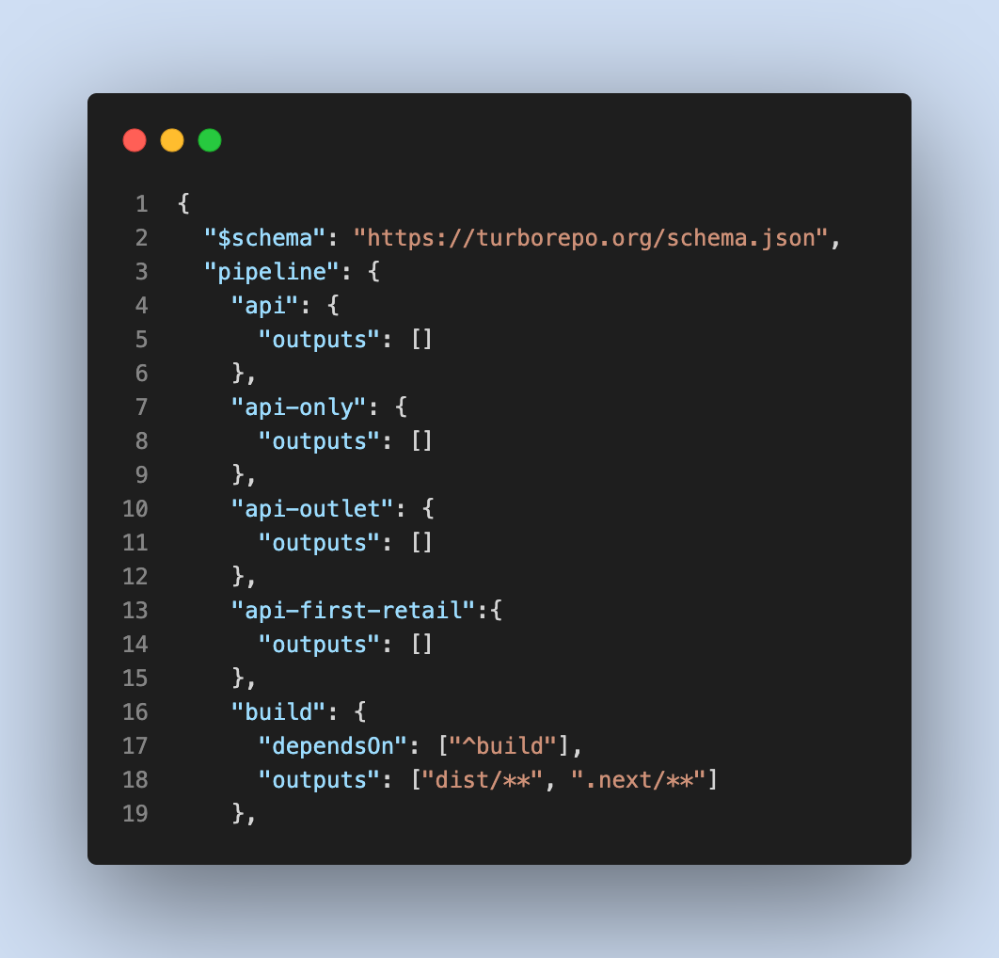
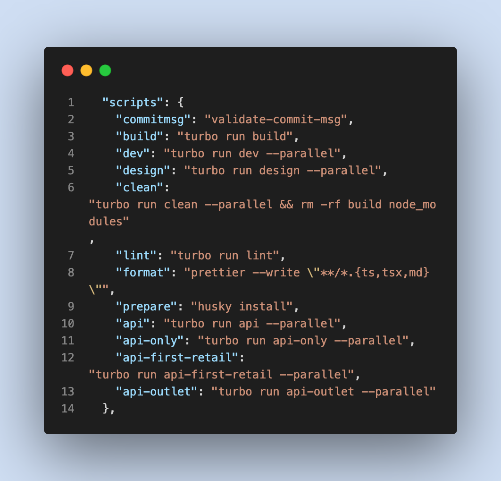

### 9/8/2022 - Final config for turbo repo to be able to start using repository for commits

* CLI tooling for repo to enable api and design modes from the root, clean and build tools. 
* need to make the same script key in all relevant packages
* also edit the turbo.json 
* git commit msging enformace with regex 
  #### '([A-Z]{2,}-\d+)'

  #### Turbo JSON
  

  #### Package JSON
  

